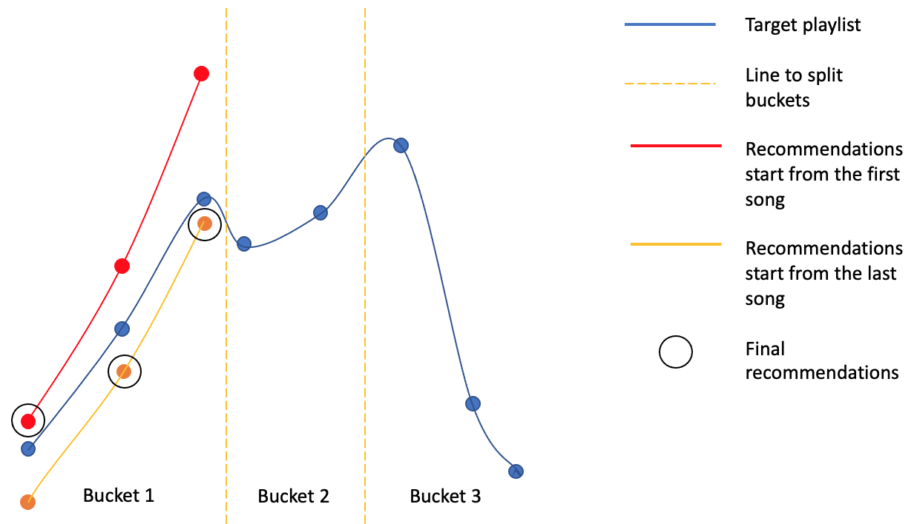

# Song-Recommendation-System
Song Recommendation System based on the user's workout plan and previous listening history on Spotify.

## Phase 1
#### Goal
Given a playlist or a list of songs and the user's listening history, the machine can generate a list of song recommendations that should maintain the "energy curve" (we only consider the direction of the trend) for workout purposes and and the generated playlist should be similar to the target as close as possible. To reduce the deviation between the original playlist and the recommended playlist, "Meet Middle" method was proposed and implemented. 

#### Methods
There are a total of four proposed methods:

- **Pure method**: <u> Submit queries to Spotify Get Recommendations API and get a list of recommendations for each song in the target playlist, and then filter these recommendations according to the trend of energy.</u> This means that if the second song has a smaller energy than the first one in the target playlist, the second recommended song should also have a smaller energy than the first recommended song. 

- **Meet-middle method**: Since the Pure method starts from the first song, the difference between the target plalylist and the list of recommended songs will enlarge as the number of songs increases. To alleviate this issue, I proposed the **Meet-middle method**. In this method, <u>I first create several buckets based on time</u>. For example, for a target playlist with a total duration 63 mins, I can create 10 mins, 15 mins, 20 mins, 10 mins, and 8 mins buckets. <u>Within each bucket, we generate two lists of recommendations, one of which starts from the first song and the other one starts from the last song. For bucket that has more than one songs, we then try to find a way to connect these two lists of recommendations to generate the final list of recommendations for the whole target playlist.</u> To do this, within each bucket, we start from the middle song, we check whether the energy trend is satisfied. If so, we can connect the two lists at the middle place. If not, we will move to the next song that is close to the middle one, and redo the checking. And finally, we can output the final list of recommended songs.

- **Recommend first, then place common songs**: <u>Use a **modified version of Pure method** to generate a list of recommendations. Then replace some recommendations by common songs. </u> To do this, we compare the "difference" between each recommendation and each common song and finally replace some recommendations with common songs based on similarity.

- **Place common songs first, then recommend**:<u> Compare the "difference" between each target song and each common song and determine the places for some common songs. Then use **Meet-middle method** to generate recommendations between common songs. 

## Phase 2
#### Goal
Given the workout plan of the user, the machine can generate a playlist using top songs or recently played songs. Combine phase 1 and 2, first use phase 2's method to generate a "target" playlist and then use phase 1's methods to customize the recommendations.

## Phase 3
#### Goal
Apply machine learning methods to learn and customize the parameter weights, and provide personalized recommendations for each user.
